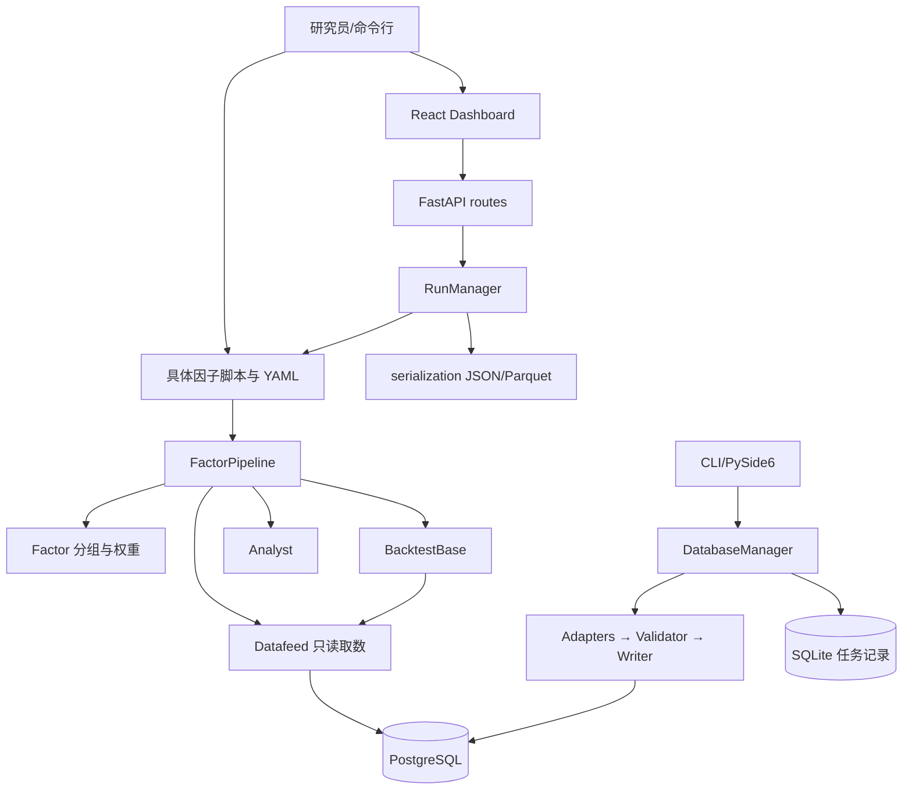

# 01：架构与入口

[导航](README.md) · 下一章：[数据契约](02_数据与接口契约.md)

## 1. 技术栈与系统边界

这是一个同仓库维护的 Python 研究工具库、数据库管理程序和浏览器工作台。Dashboard 后端直接调用同一份 Python 研究代码，并非为每个模块启动一个微服务。

| 层 | 实际技术 | 维护意义 |
| --- | --- | --- |
| 研究计算 | Python、pandas、NumPy、SciPy、statsmodels | 很多协议是 DataFrame 形状，不只是 Python 类型 |
| 行情/研究数据 | PostgreSQL、psycopg2、显式 SQL | 没有 ORM 替你同步 migration 与查询 |
| 导入任务记录 | 本地 SQLite | 与 PostgreSQL 数据分工不同 |
| HTTP 后端 | FastAPI、Pydantic、Uvicorn | 响应模型、业务深层校验与状态机都要看 |
| 浏览器端 | React 19、TypeScript、Vite、Plotly | TS 类型不能代替后端 JSON 运行时校验 |
| 数据库桌面界面 | PySide6 | Qt 主线程和后台任务不能混用 |
| 包构建/文档 | setuptools、Sphinx | pip 包不包含整个因子研究目录 |

项目声明 Python >=3.10；前端文档要求 Node >=20.19；版本范围以 `pyproject.toml`、`package.json` 为准。`full` 不包含所有测试/文档依赖。

## 2. 模块地图

数据库管理层改变数据，研究层读取数据，展示层把结果转成用户看得懂的形式。改变其中一层的协议，需要检查上下游而不是只看当前文件。

## 3. 启动入口及副作用

| 入口 | 走到哪里 | 实际行为 |
| --- | --- | --- |
| `python factor_NAME.py --config ...` | `run_from_config → FactorPipeline.run` | 加载参数、查询、计算、写报告 |
| `dashboard/run_backend.bat` | `dashboard.backend.main:app` | 启动/复用本地 Uvicorn |
| `dashboard/run_frontend.bat` | `npm run dev → vite.config.ts` | 缺依赖时安装；Vite 插件也可能启动后端 |
| `python -m betalens_db_manager plan` | `__main__.py → DatabaseManager` | 生成数据库/清单计划；可能检查现状 |
| `python -m betalens_db_manager init/import ...` | schema 或导入任务 | 写数据库并生成记录 |
| `python -m betalens_db_manager` | `gui_app.main` | 打开桌面界面 |
| `run_mining(...)` | `betalens.factor.mining` | 调度候选、缓存、评价、审计 |

`import betalens` 使用部分延迟导出；`import betalens.factor` 的 `__init__.py` 却会导入若干子模块。不要笼统宣称所有 import 都轻量。

## 4. 一次因子运行的调用链

1. 完整 YAML 进入 `load_yaml_config`，校验必需分节。
2. `factor_spec_options` 将公式/输入/权重配置变成 `FactorSpec` 参数；`run_parameters` 提取日期、组数、输出路径。
3. `FactorPipeline.run` 取交易日、确定信号日、构造历史成分并集和逐期掩码。
4. Datafeed 返回长表，`fetch_daily_wide` 等转换为宽表并对齐。
5. `spec.compute(**wides, **compute_kwargs)` 计算因子；宽转长，执行相应预处理与分组。
6. 标签表变目标权重，附现金与执行时间。
7. `BacktestBase(...)` 在构造期间匹配价格、处理状态、生成股数及日频净值。
8. `Analyst` 提取指标、输出报告；`RunResult` 装回测对象和诊断。
9. Dashboard 还通过 serialization 转 JSON、缓存明细 Parquet、提供下载。

选择一个数据时点沿此链路跟踪，比一次读完上千行管线更有效。

## 5. 新手阅读代码的六个概念

- **门面（facade）**：统一外部调用方式，如 Datafeed、DatabaseManager；复杂分支在内部模块。
- **适配器（adapter）**：把不同来源转换成同一种协议，如 EDE → ImportBatch。
- **数据类/模型**：声明字段，如 FactorSpec、QueryRequest、RunRequest；字段名本身不代表业务校验完整。
- **纯函数**：相同输入对应计算输出，不查库写文件；优先用小样本理解，如 metrics。
- **副作用**：数据库连接、写文件、启动线程、修改实例属性。这些也是函数输出的一部分。
- **延迟 import**：到使用时才加载依赖，帮助轻量入口启动；不代表后续调用不需要安装依赖。

练习：画一张“点击运行到结果下载”的图，标出每个会读数据库和写文件的节点。下一章为每条边补上数据类型。
