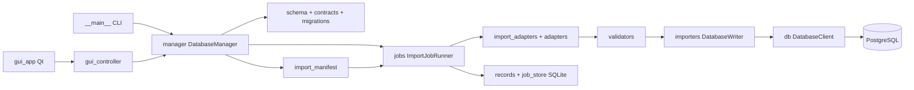

# 04：数据库管理代码与事务边界

[导航](README.md) · [逐文件接口](generated/db_manager.md) · [迁移文件](generated/db_migrations.md)

## 1. 为什么与 Datafeed 分开

Datafeed 是研究只读层；管理器负责建库、迁移、输入文件适配、校验、写入、删除、任务记录和桌面管理。它们共享逻辑数据集名字，但连接权限与副作用不同。

`DatabaseManager` 是无 Qt 门面，CLI、GUI 都调用它。不要把导入规则写在一个按钮回调里，否则命令行与 GUI 会得到不同结果。

## 2. 文件级角色图

## 3. 一份文件怎样写入数据库

**输入。** 文件路径、目标逻辑表、adapter、mode、options。文件格式只回答怎样读取字节，adapter 还需知道怎样解释字段和日期。

**预览。** `ImportJobRunner.preview` 计算文件哈希，读取批次，展示有效/拒绝行、校验、数据库冲突及 token。默认 inspect_database=True，所以预览也可能查询数据库。预览数据不代表已经提交。

**执行。** `run` 再核对 expected_sha256、preview_token 和选项；源文件、目标或模式改变后，旧预览失效。正常路径通过 `valid_frames` 等将校验后的批次交给 writer。

**写入。** `DatabaseWriter.write_batches` 使用 staging、COPY、维度解析与分类型事实写入。它需要区别核心行情列、一般观测、行业、指数快照、交易状态和交易日历，不能全都视为普通 value 行。

**完成。** 输出任务记录、数据库变化、日志与拒绝行文件；JobStore 保存本地任务状态。失败/取消应按文件级事务恢复，不能留下“前半个文件写入、任务却显示成功”的语义。

## 4. 适配器到底输入输出什么

| 文件 | 输入 | 输出 |
| --- | --- | --- |
| adapters/files.py | CSV/Excel、编码/读取选项 | 原始 DataFrame 或分块迭代 |
| adapters/ede.py | EDE 宽表及指标日期元信息 | 规范化指标记录 |
| adapters/industry.py | 行业成员及分类设置 | 行业记录 |
| adapters/wind.py | 代码/日期、WindPy 客户端 | 在线取得的标准行情 |
| import_adapters.py | source + target + adapter/options | 带类型的 ImportBatch、rejected、元信息 |
| validators.py | 待写规范化 frame | ValidationReport：ok/errors/warnings/stats 等 |

ImportBatch 子类包括 MarketBatch、ObservationBatch、IndustryBatch、IndexSnapshotBatch、TradeStatusBatch、TradeCalendarBatch。阅读这些 dataclass 的字段，比猜一个通用 DataFrame 包含什么更可靠。

当前 `adapters/files.read_file` 明确读取 CSV/XLS/XLSX。即使项目安装了 pyarrow，不能据此说这条源文件入口支持 Parquet；Parquet 的明确用途之一是 Dashboard 结果缓存。

## 5. 结构、注册表与迁移

`registry.py` 管逻辑名字和可写性，`contracts.py` 管某版本应有的表列索引，`schema.py` 管 migration 载入、校验和、执行与验证。SQL 在 migrations/ 内，当前编号为 0001—0010。

| 迁移阶段 | 作用 |
| --- | --- |
| 0001—0002 | 初始化 schema、元信息、证券和指标维度 |
| 0003—0004 | 日行情事实与一般观测事实 |
| 0005 | PIT 行业/成分/状态相关结构 |
| 0006—0007 | 旧数据迁移与兼容视图 |
| 0008—0009 | 收尾、生命周期与审计完善 |
| 0010 | 本地交易所日历 |

已应用 migration 的校验和用于发现历史文件被改写。新增结构应使用新版本文件，并同步 contract 与 registry；不要在旧 SQL 里修改一列后期待已经建好的数据库自动重跑它。

`plan` 是计划，`init` 执行结构变更，`verify` 核验结构/约束等。它们成功不代表研究行情覆盖完整，也不能替代导入数据质量检查。迁移事务边界以 schema 实现为准，不应把多版本升级想当然当成全流程单事务。

## 6. 两种数据库与恢复

PostgreSQL 保存研究数据；`job_store.py` 的本地 SQLite 保存任务、日志索引/检查点。删本地任务记录不等于回滚 PostgreSQL；回滚数据库也不能自动修好所有已经写出的报告状态。

Manifest 允许多个匹配文件，每个文件对应独立事务/检查点。后面一个失败时，之前已经完成的文件通常仍完成；恢复需要检查哈希、配置与检查点，而非盲目全部重新 upsert。

`records.py` 为旧接口提供兼容包装，不应该再实现一个并行记录系统。profile 档案设计不持久化密码，但 `effective_config` 仍可能包含会话密码，日志展示应使用脱敏的连接信息。

## 7. GUI 的维护边界

`gui_app.py` 管 QWidget、表格模型、对话框和 worker；`gui_controller.py` 管业务计划、忙碌操作和预览失效检查；`gui.py` 是公共包装入口。

后台线程执行 I/O，界面通过 signals 接收进度。业务方法保持 Qt-free 可让测试直接调用 controller，不需要真的打开窗口。不能从 worker 随意修改 Qt 控件；也不能把耗时导入放回主线程导致假死。

## 8. 一个典型 bug 如何定位

现象：“预览正确，导入后日期错了。”依次检查：源文件单元格 → adapter 的日期解析 → apply_time_alignment → 标准批次 → writer 对 available_at/trade_date 的写法 → 兼容视图 → Datafeed 查询。每一段保留同一条样本的 code、metric 和时间，能确定第一次发生偏差的位置。

维护任务必须在隔离测试库做写入/删除/迁移验证；只拿公司共享库跑一遍成功，不是可重复的维护证据。
