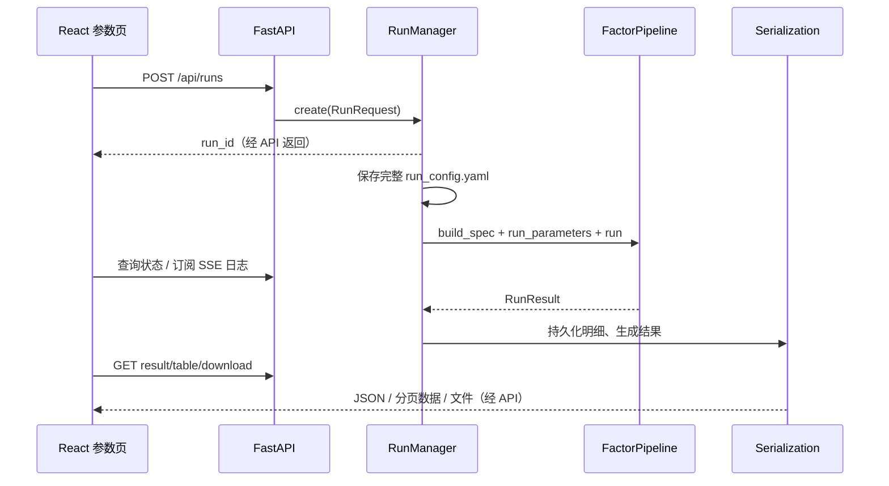

# 05：Dashboard 前后端与异步任务

[导航](README.md) · [后端逐文件](generated/dashboard_backend.md) · [前端逐文件](generated/dashboard_frontend.md)

## 1. 一次点击的完整生命周期

run_id 返回代表任务被接受，不是回测完成。`completed` 与某个异步导出文件已经落盘也不是完全同一个时刻。

## 2. 后端六个主要文件

| 文件 | 关键入口 | 输入→输出 | 维护重点 |
| --- | --- | --- | --- |
| main.py | route 函数 | HTTP→响应/状态码 | 只做边界适配，避免重复业务逻辑 |
| schemas.py | RunRequest/RunState 等 | JSON→Pydantic 对象 | 深层 parameters 仍需校验 |
| factors.py | discover/get_detail/load_module | YAML/名称→列表、详情、模块 | 缓存与路径、import 副作用 |
| runs.py | create/_execute/serialize_result | 请求→状态机和运行结果 | 并发、清理、异常、输出目录 |
| serialization.py | build_result_payload/read_table_page | pandas/对象→JSON/分页 | NaN、时间、字段名、过滤与分页 |
| eventstudy_dashboard.py | run_event_study | 事件文件/参数→事件 JSON | 文件扫描、安全路径和事件对比对齐 |

主要状态：`queued → running → completed/failed`。状态与错误信息存于 DashboardRun，任务字典在 RunManager 内存中。不能把它等同支持跨进程恢复的持久化任务队列。

## 3. HTTP 契约和错误码

| 接口 | 作用 | 重要条件 |
| --- | --- | --- |
| GET /api/health | 返回 ok | 不验证 DB 或可回测性 |
| GET /api/factors | 因子发现 | refresh=true 清发现缓存 |
| GET /api/factors/{class}/{name} | 详情和默认参数 | 不存在可返回404 |
| POST /api/runs | 新建因子运行 | 业务创建异常映射400，响应是run_id |
| GET /api/runs/{id} | 状态 | 未找到404 |
| GET /api/runs/{id}/result | 结果 | 未完成409，序列化异常500 |
| GET /api/runs/{id}/logs | SSE 日志 | log与close事件；终态后结束 |
| GET /api/runs/{id}/table/{kind} | trades/positions 分页 | page>=1，size 1—500 |
| GET /api/runs/{id}/download/{kind} | 下载现有文件 | 文件尚未存在时404 |
| POST /api/eventstudy/run | 事件研究 | 走自己的同步路由调用，不通过因子 RunManager.create |
| DELETE /api/runs | 清理任务缓存 | 会改变状态和清理临时资源，不是只刷新页面 |

SSE 每个事件有名字与 JSON 数据。后端循环从日志 cursor 提取新增内容，终态后发 close。前端组件卸载、切换任务时要关闭旧 EventSource，防止旧日志写入新页面。

## 4. 并发与取消的真实含义

常规因子执行使用 `ThreadPoolExecutor(max_workers=1)`；Excel dump 使用另一个单线程 executor。串行默认减少资源竞争，但不是全局永远只有一条业务线程。

`clear()` 会标记 queued/running 任务失败、清理记录、取消排队 futures 并重建 executor；注释明确正在执行的线程无法安全强杀。因此清理后旧计算可能仍在后台，不能向用户承诺“按下清理立即停止数据库/计算”。修改取消策略要考虑旧任务后续写文件、状态更新和新任务并发。

`redirect_stdout/stderr` 等日志捕获与线程存在交互，增加并行数不是只把 1 改成 4。还要审视共享缓存、全局输出、数据库连接与文件路径。

## 5. 前端每个代码文件

| 文件 | 输入 | 输出 | 主要依赖 |
| --- | --- | --- | --- |
| main.tsx | DOM root | App 挂载 | ReactDOM、App |
| App.tsx | API 数据、表单、状态 | 页面与交互 | api、types、PlotView、styles |
| api.ts | 参数、run_id、分页筛选 | Promise 响应或 Error | fetch、URLSearchParams |
| types.ts | 后端 JSON 协议 | 编译期类型 | 与 schemas/serialization 同步 |
| PlotView.tsx | data/layout/config | Plotly React 图形 | Plotly factory |
| plotly.d.ts | 模块类型缺口 | TypeScript 声明 | 编译时使用 |
| styles.css | DOM 类名/布局 | 视觉样式 | App JSX 类名 |
| vite.config.ts | 环境变量和开发启动 | API 代理、可能自动启动后端 | Node 子进程及本地 Python |

App.tsx 包含多个组件，不只是一个函数：App 控制页面；HomePage/FactorDirectory 列因子；FactorPage/ParameterPanel 编辑与运行；EventStudyPage 展示事件；Overview/TimingOverview 显示结果；FactorProfilingPanel 显示体检；Trades/Positions/ResultTable 处理分页明细；Logs 处理日志。

先定位相关组件再改动，避免一次把整个单文件重构与业务修复混在一起。整理组件时需要保持 props、状态归属、请求时机和筛选行为。

## 6. 结果字段怎样跨越后端与前端

例如新增指标：计算函数 → Analyst 汇总（如需要）→ serialization 的指标记录 → types.ts 的 Metric/结果类型 → App 格式和展示。数值 0、None、NaN 不能统一写成空字符串；日期不要在一层用 UTC、另一层默认当本地日而不说明。

表格的 query、filter.*、date_from/to、page/size 经 api.ts 编码后传给后端。更改筛选条件通常要重置页码；否则用户看见空页，不一定是后端没数据。

`api.ts` 的通用请求器对网络错误和部分5xx会重试，并未只限定 GET，创建任务 POST 也可能被重发。涉及任务重复创建的修复应考虑幂等协议，而不是仅加一段前端提示。

## 7. 开发启动与部署边界

`npm run dev` 经过 vite.config.ts 的插件，在健康检查未发现后端时可能启动 Uvicorn。BAT 后端启动又可能复用现存服务，调试时必须确认当前服务来自哪一个解释器和工作区。

当前 package.json 仅声明 dev/build/preview，没有 npm test/lint。`npm run build` 做 TypeScript build 和 Vite 打包。源码所示本地服务、CORS 与开发端口不等于已配置生产认证、部署或多用户任务隔离；相关工作需另行设计。
